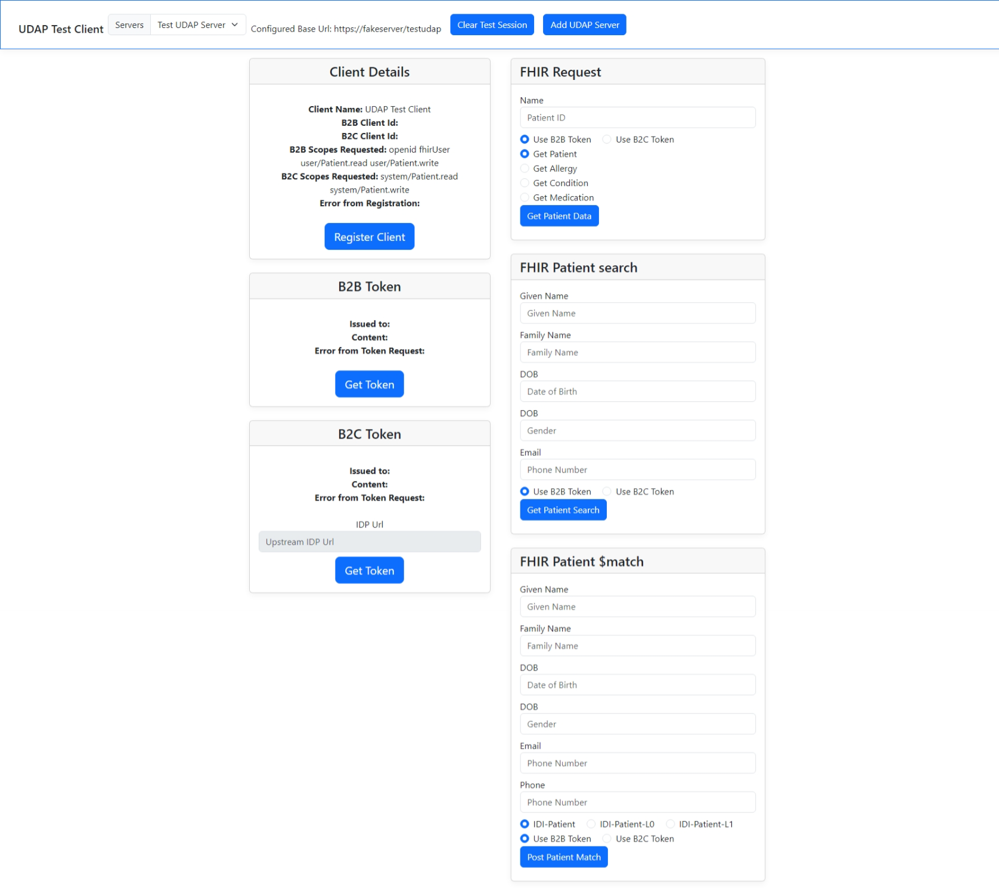
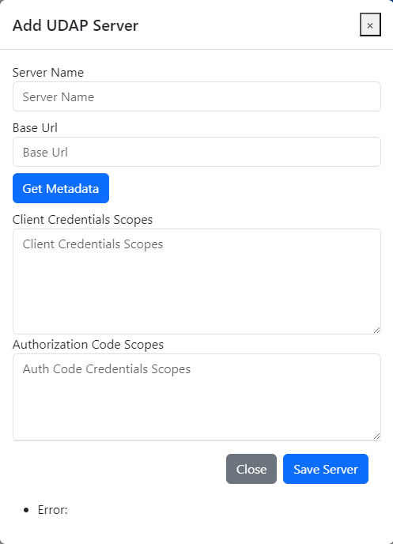

# hl7-fhir-udap-client-test-ui

## Getting Started

For a general overview of UDAP as well as a getting starting guide of the full four-repository collection see [UDAP Documentation](https://github.com/Evernorth/hl7-fhir-udap-docs#readme)

## Overview

This nodejs/express/handlebars user interface project represents a user interface/test harness for a full UDAP (Unified Data Access Profiles) Client implementation. The user interface is part of a four-repository collection for a full [UDAP](https://www.udap.org/) implementation. The implementation adheres to published Version 1.0 of the [HL7 UDAP Security Implementation Guide](http://hl7.org/fhir/us/udap-security/STU1/).

The client side components of the following features of the IG are supported:
- [UDAP trusted dynamic client registration](http://hl7.org/fhir/us/udap-security/STU1//registration.html)
- [B2B Authorization](http://hl7.org/fhir/us/udap-security/STU1//b2b.html)
- [B2C Authorization](http://hl7.org/fhir/us/udap-security/STU1//consumer.html)
- [Tiered OAuth](http://hl7.org/fhir/us/udap-security/STU1//user.html)

The user interface supports the UDAP version of OAuth2 Client Credentials Flow and Authorization Code Flow. Throughout the user interface (and code base), they are referred to as B2B (Client Credentials Flow) and B2C (Authorization Code Flow).

Links to the other repositories in the collection:
- [hl7-fhir-udap-common](https://github.com/Evernorth/hl7-fhir-udap-common#readme)
- [hl7-fhir-udap-client](https://github.com/Evernorth/hl7-fhir-udap-client#readme)
- [hl7-fhir-udap-server](https://github.com/Evernorth/hl7-fhir-udap-server#readme)

## Client Test User Interface


## User Interface UDAP Features
The following features are supported by the user interface:

**Add Servers**: The user interface supports adding different UDAP servers so the client can connect with multiple different servers in the community.


**UDAP trusted dynamic client registration**: When a new server is added the next step is to have the client register with that server.  Using the Register Client button, the client is triggered to use UDAP trusted dynamic client registration to dynamically get a client id for that server. The registration is executed twice, once for Authorization Code Flow (B2C Registration) and once for Client Credentials Flow (B2B Registration). If a client id already exists, an "edit registration" is performed.

**UDAP B2B Authorization**: This supports the UDAP version of OAuth2 Client Credentials Flow for obtaining an access token. It is trigged by clicking the Get Token button in the B2B Token section of the user interface.

**UDAP B2C Authorization**: This supports the UDAP version of OAuth2 Authorization Code Flow for authenticating and obtaining an access token. It is triggered by clicking the Get Token button in the B2C Token section of the user interface.

**UDAP Tiered OAuth**: This supports the [Tiered OAuth](http://hl7.org/fhir/us/udap-security/STU1//user.html) flow, where the client passes in a preferred OpenID Connect Identity Provider (IDP) that the client wishes to user for user authentication. This is triggerd by populating the Upstream IDP URL text box in the B2C Token section of the user interface and then clicking the Get Token button in the same section. The Upstream IDP URL box will be disabled if the currently selected server does not support Tiered OAuth.

## User Interface FHIR Features

**FHIR Request**: This section supports issuing various FHIR resource get requests using a patient identifier. The resources currently supported are Patient, Allergy, Condition, and Medication. The resources are selected by using the resource radio buttons in the FHIR Request section of the user interface. The requests can be issued using either the B2B or B2C token by using the token radio button in the same section. The request is triggerd by clicking the Get Patient Data button.

**FHIR Patient Search**: This section supports issuing a FHIR search on the Patient resource using the text boxes. The request can be issued using either the B2B or B2C token by using the token radio button in the same section. The request is triggerd by clicking the Get Patient Search button.

**FHIR Patient $match**: This section supports issuing a post FHIR patient $match operation request. There are radio buttons to select the IDI Patient profile used in the request as defined here [Patient Weighted Input Information](http://hl7.org/fhir/us/identity-matching/2022May/patient-matching.html#patient-weighted-input-information). The request can be issued using either the B2B or B2C token by using the token radio button in the same section. The request is triggerd by clicking the Post Patient Match button.

## Usage

To use the user interface, you must have the following pre-requisites:

- [hl7-fhir-udap-common](https://github.com/Evernorth/hl7-fhir-udap-common#readme)
- [hl7-fhir-udap-client](https://github.com/Evernorth/hl7-fhir-udap-client#readme)
- Node.js
- At least one base URL of the UDAP secured FHIR server you are going to use
- The client will need a trust community certificate for at least one trust community.  The certificate and community trust anchor will need to be placed in the udap_pki folder.

## Installation

The repositories are currently set up for local installation. Placing all four repositories under the same parent folder will allow the package.json local file references to be resolved accurately. This repository will eventually be an npm package. 

### Step 1- Clone needed UDAP repositories
- [hl7-fhir-udap-common](https://github.com/Evernorth/hl7-fhir-udap-common#readme)
- [hl7-fhir-udap-client](https://github.com/Evernorth/hl7-fhir-udap-client#readme)

### Step 2- Install dependencies
```
npm install
```

### Step 3- Configure default.json file
Fill in all the fields in the config/default.json file. You will need to place your community certificate and trust anchor file in the udap_pki folder.

### Step 4- Run the app
Run the user interface locally.
```
node app.js
```

After you run the app, the first thing you will be presented with is the Add Server screen.  

## Known Issues
- The Add Server form does not use client side validation.  Once that is added the check on the server side can be removed.
- Console.debug statements with TODO comments should not be inlcuded in production applications.

## Getting Help

If you have questions, concerns, bug reports, etc., file an issue in this repository's Issue Tracker.

## Getting Involved

See the [CONTRIBUTING](CONTRIBUTING.md) file for info on how to get involved.

## License

The hl7-fhir-udap-client-test-ui is Open Source Software released under the [Apache 2.0 license](https://www.apache.org/licenses/LICENSE-2.0.html).

## Original Contributors

We would like to recognize the following people for their initial contributions to the project: 
 - Tom Loomis, Evernorth
 - Dan Cinnamon, Okta